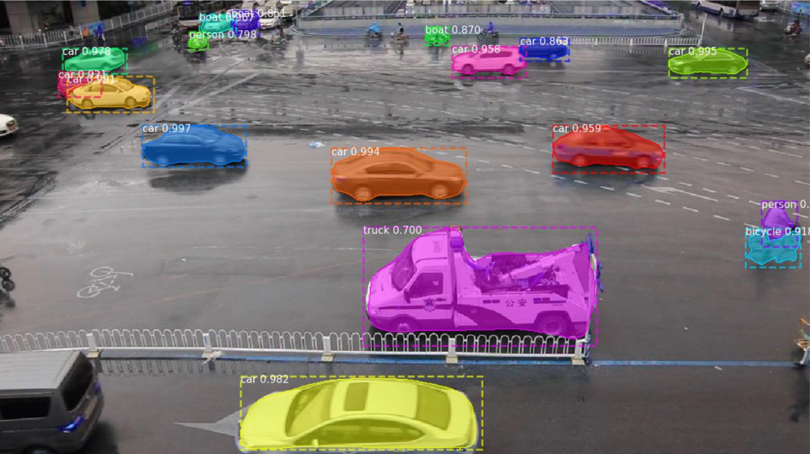
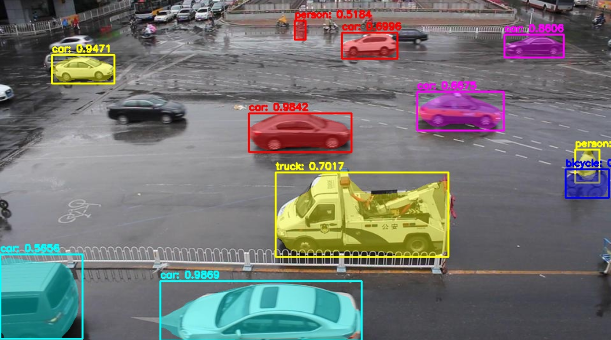
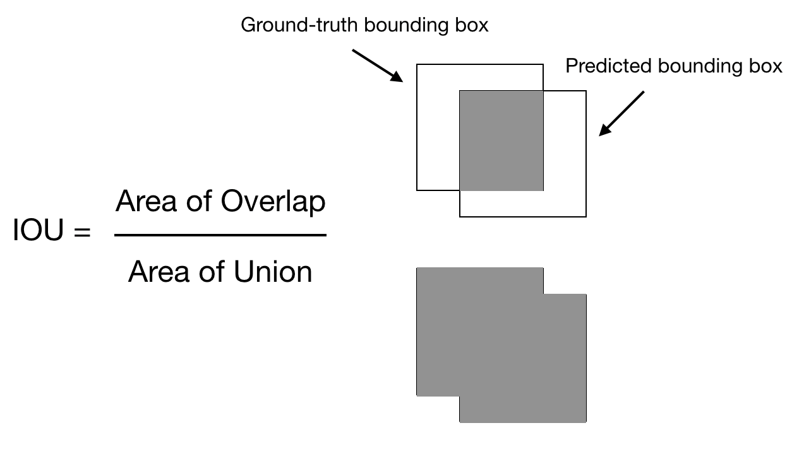
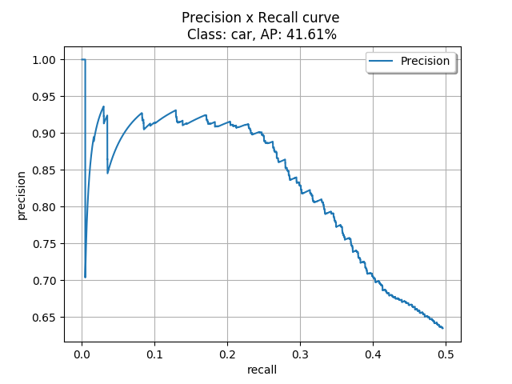
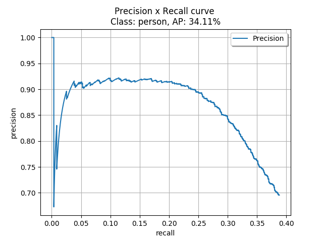
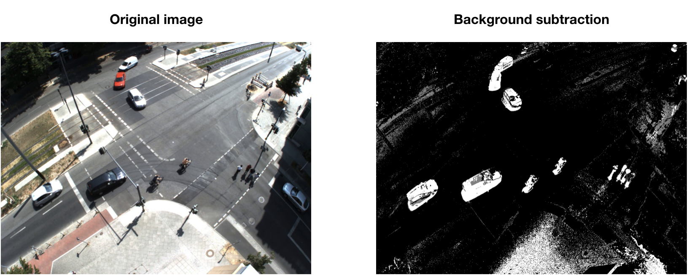
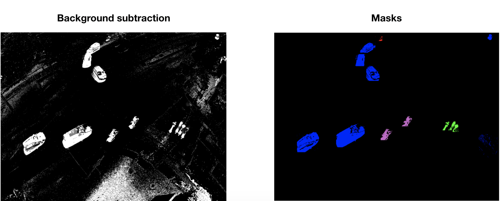
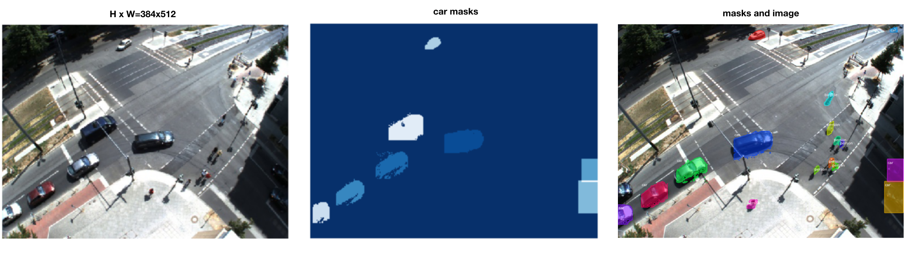
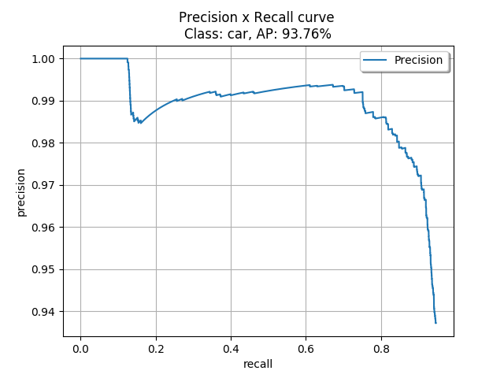
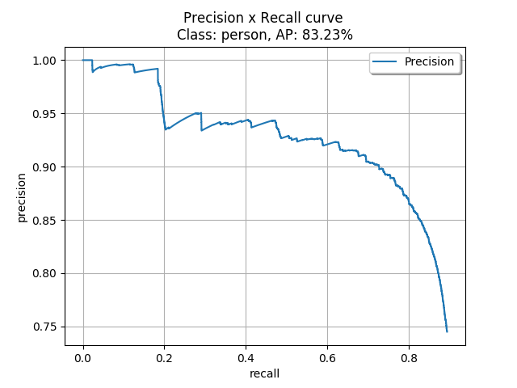

# Mask R-CNN for Traffic Detection

This project uses the Mask R-CNN algorithm to detect features in traffic videos. The goal is to test the Mask R-CNN neural network algorithm and improve object detection and segmentation in traffic by detecting objects filmed from long distance and using wide angle lenses.

I used a pre-trained model on the COCO dataset and tried to improve results for the following seven classes: person, bicycle, car, motorcycle, bus, train, truck. I was adding notes on my workflow so that one could follow the steps how to set up, evaluate and train an existing Mask R-CNN Model. My workflow is listed below.

The Mask R-CNN was published March 2017: [Mask R-CNN paper]
The Implementation of Mask R-CNN I used for this project: [Matterport Mask R-CNN]

---

# Project Workflow

  1. [Running a pre-trained model](#choosing-a-pre-trained-model)
  2. [First results](#first-results)
  3. [Choosing output format](#choosing-output-format)
  4. [Evaluating pre-trained model](#evaluate-coco-model)
  5. [Data Annotation](#data-annotation)
  6. [Training Mask RCNN model](#Training-mask-rcnn-model)
  7. [Evaluating fine-tuned model](#evaluate-fine-tuned-model)
  8. [Final result](#final-result)


# Running a pre-trained model

Mask R-CNN was trained on [COCO dataset] which includes 80 different classes. For this project I only needed seven of them. You can find the code how to load your pre-trained weights in process_video.py. The result with detected objects will first be stored as a video file. Here are some examples how pre-trained coco weights perform on already mentioned seven classes: 



For comparison, this Mask R-CNN model with one of Tensorflow models from [Tensorflow Object Detection API]

- mask_rcnn_inception_v2_coco (Tensorflow)



After testing Tensorflow Inception V2 Model on my data I decited to use Model from Mask R-CNN since it was more accurate with detecting different vehicles and people.

# First Results

In this project I had a specific dataset where objects were recorder from a long distance and in a different sunlight. In total I had 30000 frames filmed from the same location. Here is the result of running a small (~200 frames) cut from a video:


# Choosing Output Format

### Tracking with bounding boxes

  Just like in object detection with bounding boxes one could track objects by finding the center of the rectangle. Following output file looks like this:
    
  __(frame number, class, left, top, right, bottom, score)__

  where (left, top) is the topmost-left and (right, bottom) is the bottommost-right point coordinates of the bounding box
  
### Tracking with center (centroid) coordinates:
    
  Having an exact mask of the object I calculated the center point which is more exact. Finding the center of binary mask was done using cv2.findContours() and cv2.moments(). Here's the following output file format: 
    
  __(frame number, class, center_left, center_top, score)__
    

# Evaluating COCO-trained Model

### Intersection over Union (IoU)

Evaluates the overlap between two bounding boxes. IOU is given by the overlapping area between the predicted bounding box and the ground truth bounding box divided by the area of union between them.

<div align="center">
  
</div>

### True Positive, False Positive, False Negative and True Negative

  - **True Positive (TP)**: A correct detection. Detection with IOU ≥ threshold
  - **False Positive (FP)**: A wrong detection. Detection with IOU < threshold
  - **False Negative (FN)**: A ground truth not detected
  - **True Negative (TN)**: Not used by the metrics.


### Precision

Precision shows how the model is able to identify only the relevant objects.


### Recall

Recall shows how the model is able to find all the relevant cases (all ground truth bounding boxes).


### Precision x Recall curve
While doing this project I was evaluating the models using Precision x Recall curve. However, I was evaluating only bounding box predictions and not mask shapes. Doing that i wanted to compare results with coco pre-trained models with YOLO object detection.

Precision x Recall curve: An object detector of a particular class is considered good if its precision stays high as recall increases, which means that if you vary the confidence threshold, the precision and recall will still be high.

For evaluating my weights i was using following project: 
[Object Detection Metrics]

Here you have to separate groundtruths from pradictions in different folders and create .txt files for each frame with predictions inside.

I set my IOU Threshold value equal to 0.5 and prepared 3000 frames of groundtruths and detections. 

Here are the results with COCO pre-trained weights for __Car__ and __Person__ (after running both models on 3000 frames of my data):

Car      |  Person
:-------------------------:|:-------------------------:
 | 

Here are the the Average Precision (AP) values for all the classes:

AP: 0.00% (bicycle)  
AP: 52.35% (bus)  
AP: 44.72% (car)  
AP: 16.09% (motorcycle)  
AP: 34.11% (person)  
AP: 6.80% (truck)  
mAP: 25.68%

# Data Annotation

### Annotating bounding boxes
I used Computer Vision Annotation Tool (CVAT) to label 1000 images with bounding boxes. CVAT returns annotations in XML format, so I parsed it to csv. The file is stored [here](https://gitlab.informatik.hu-berlin.de/cv/semesterprojekt-2019-objekterkennung-a/blob/master/annotations/3000.csv). In total we had ~7000 groundtruth frames annotated with bounding boxes. 

### Annotating masks

Since there are around 10 objects in each frame, I tried to annotate masks automatically. Mask annotation was done by subtracting the background from original image and removing the area outside bounding boxes.

  1. Background subtraction using MOG2 Subtractor
  2. Setting area outside bounding boxes to black
  3. Coloring each object class

- __Background subtraction__

 <div align="center">
  
</div>

 - __Mask annotation__

 <div align="center">
  
</div>


This way I was able to annotate most of the bounding boxes with masks. However, when background subtraction is poor (segmentation covers less than 20% of the bounding box) I masked the whole bounding box. This may result in bad segmentation results after training on this data.

### Inspect Data

I prepared 1000 images for training and other 3000 frames for testing.

Training and validation data is stored inside __dataset__ folder. Each folder has images, corresponding masks and csv file with bounding boxes. To inspect the data we can try loading masks and images in traffic.py. Code is written in __inspect_data__ notebook. Here's the example of an image file and a mask file loaded and displayed in traffic.py:

 <div align="center">
  
</div>


# Training Mask R-CNN Model


Training the model for this specific task is quite different from [Balloon] or [Nucleus] since we're not adding new classes to our model. For fine-tuning of existing classes we have to keep the same number of classes (and ids) in confing file as the pre-trained model. Training is written in traffic.py and can be run using command:


```
python3 traffic.py train --dataset=dataset --weights=mask_rcnn_coco.h5 --logs=logs
```

I trained the model on google colab until loss value was 0.2. My Settings were steps:200, epochs:40.

As the result of training, new weights will be saved inside logs folder. My weights file after training: __mask_rcnn_traffic.h5__


# Evaluating fine-tuned Model

One could already see the improvement in the video and output csv file. I ran detection on 3000 frames and saved the output file for testing. The output file had twice as many detections as the pre-trained model.

I evaluated newly trained weights. To compare it with the pre-trained COCO Model I took the same 3000 frames for testing. Here's the Precision x Recall curve for __Car__ and __Person__ classes:


Car      |  Person
:-------------------------:|:-------------------------:
 | 

And the following APs:

AP: 51.41% (bicycle)  
AP: 63.73% (bus)  
AP: 93.74% (car)  
AP: 60.55% (motorcycle)  
AP: 83.23% (person)  
AP: 57.32% (truck)  
mAP: 68.33%  


# Final Results

Below is an example how the trained model performs on our traffic data. I processed all 30000 for the final presentation of the project. Output CSV file (format as discussed in the previous section) can be found in detections folder here.


## Comments on the result

  - Automating mask annotation did produce pretty good results for our data. It worked for this project since The goal was to detect a center point of the object and in our case (vehicles filmed from above) the center point of the mask and the bounding box didn't differ too much.

  - However, properly annotated masks are very important for good model performance and I'd recommend to annotate a small set of data with an annotation tool and train the model again. Combining properly (drawing polygons) and automatically (using background subtraction) annotated Images would result in better segmentation accuracy. I'd also recommend investing more time in mask annotation and find better ways to automatically annotate masks and add other steps after background subtraction (f.e. Morphological Image Processing).

  - I Noticed that one doesn't need much training data to fine tune already existing class in COCO pre-trained model. I trained the model with 1000 images and the average precision for the two main classes (car, person) Increased from 40 to 90 percent.


[Mask R-CNN paper]: <https://github.com/joemccann/dillinger>
[Matterport Mask R-CNN]: <https://github.com/matterport/Mask_RCNN>
[Tensorflow Object Detection API]: <https://github.com/tensorflow/models/blob/master/research/object_detection/g3doc/detection_model_zoo.md>
[Object Detection Metrics]: <https://github.com/rafaelpadilla/Object-Detection-Metrics>
[COCO Dataset]: <cocodataset.org/>
[Nucleus]: <https://github.com/matterport/Mask_RCNN/tree/master/samples/nucleus>
[Balloon]: <https://engineering.matterport.com/splash-of-color-instance-segmentation-with-mask-r-cnn-and-tensorflow-7c761e238b46>